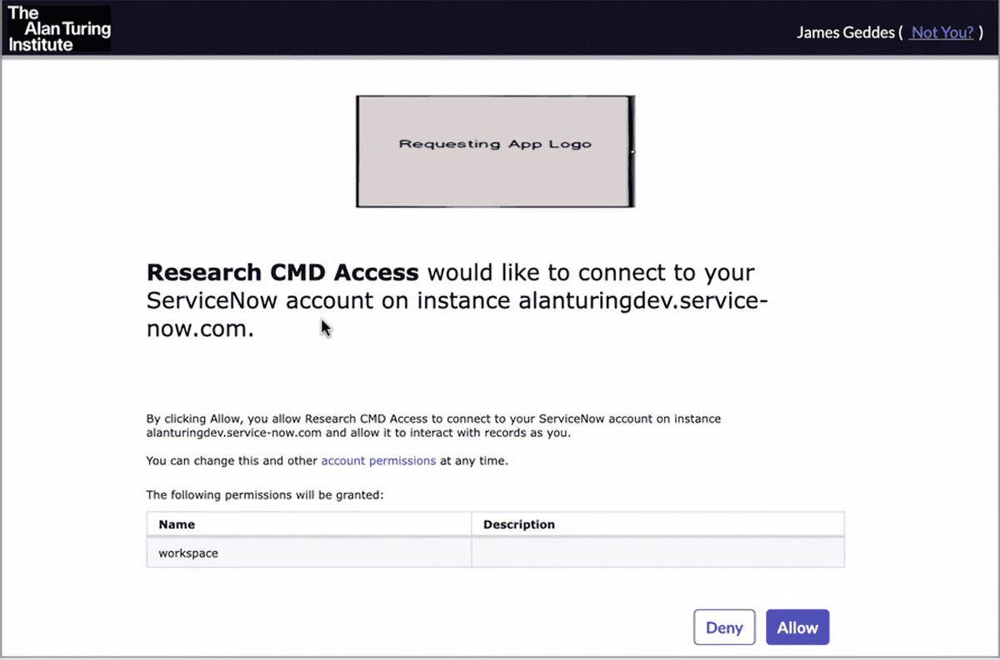

# Configuring RCPond for first use

## Prerequisites

- [`uv` installed](https://docs.astral.sh/uv/getting-started/installation/) (includes `uvx`).
- git+ssh access to GitHub, including the [rcpond-rules](https://github.com/alan-turing-institute/rcpond-rules) private repo.


## Main steps

There are three main steps to get up and running:

- Installing RCPond.
- Create the configuration files.
- Either Login using OAuth, or obtain a ServiceNow API token and add it to the configuration.

## Installing RCPond

Install RCPond using `uv`:

```bash
$ uv tool install git+https://github.com/alan-turing-institute/rcpond.git
```

This will install the `rcpond` command, add it your path and should now be available in your terminal. You can test that it is working by running:

```bash
$ rcpond --version
```

## Upgrading RCPond

To upgrade RCPond to the latest version, run the following command:

```bash
$ uv tool upgrade rcpond@git+https://github.com/alan-turing-institute/rcpond.git
```

(Optional) It is also possible to invoke rcpond directly without installing it, using `uvx`. When the `--no-cache` option is used, this will always use the latest version:

```bash
$ uvx --no-cache git+https://github.com/alan-turing-institute/rcpond.git --help
```

## Configuration

RCPond requires several credentials and paths to be configured. These can be configured in several different ways.

### Using the default configuration file (recommended)

The recommended setup is to store personal credentials in the XDG config file. There is a helper command to create a default configuration file with most required keys:

```bash
$ uvx git+ssh://git@github.com/alan-turing-institute/rcpond-rules.git
```

This will install a default configuration file at `~/.config/rcpond/default.config` .

If the command above fails try the following troubleshooting steps:

1. Check that you can access GitHub via SSH, without needed to enter a password. Test this with the following command:

```bash
$ ssh -T git@github.com
Hi <your-github-username>! You've successfully authenticated, but GitHub does not provide shell access.
```

You should see a message like the one above, confirming that you have access. If you are prompted for a password, then please follow the instructions in the [GitHub docs](https://docs.github.com/en/authentication/connecting-to-github-with-ssh). For `uvx` to work correctly, you need to have your SSH key added to the ssh-agent and have an active ssh-agent running. See Github's guide to [adding your SSH key to the ssh-agent](https://docs.github.com/en/authentication/connecting-to-github-with-ssh/generating-a-new-ssh-key-and-adding-it-to-the-ssh-agent#adding-your-ssh-key-to-the-ssh-agent)

2. If this still does not work, you can try cloning the repo and running the command locally:

```bash
$ git clone git@github.com:alan-turing-institute/rcpond-rules.git
$ uvx ./rcpond-rules
```

3. If you are still having issues, please check that you have access to the [rcpond-rules repo](https://github.com/alan-turing-institute/rcpond), by following the link in your browser. If you don't have access to the repo, please contact the RCPond maintainers to request access.


### Updating existing configuration files

By default, existing configuration files will not be overwritten. If you need to overwrite existing config files, this is possible using the `--force` option:

> [!WARNING]
> Any custom values in the existing config file will be lost.

```bash
$ uvx git+ssh://git@github.com/alan-turing-institute/rcpond-rules.git --force
```

### Other configuration options

The configuration options can be provided in several different ways. This allow for testing with different credentials and using the development ServiceNow instance without needing to change the default configuration file. Values are loaded from the following sources, in order of increasing precedence:

1. `$XDG_CONFIG_HOME/rcpond/default.config` (default: `~/.config/rcpond/default.config`)
2. A `.env` file passed via `--env-file`
3. Environment variables prefixed with `RCPOND_`
4. CLI flags (e.g. `--llm-api-key`)

### Configuration file example

The required keys depend on which ServiceNow authentication method you use (see below). A full example using OAuth:

```
# ~/.config/rcpond/default.config
RCPOND_LLM_CHAT_COMPLETIONS_URL=https://...
RCPOND_LLM_API_KEY=your-api-key-here
RCPOND_LLM_MODEL=gpt-4o
RCPOND_SERVICENOW_URL=https://turing-api.azure-api.net/dev-research/api/now/table
# RCPOND_SERVICENOW_TOKEN=your-servicenow-token  # required if not using OAuth
RCPOND_SERVICENOW_CLIENT_ID=your-client-id
RCPOND_SERVICENOW_CLIENT_SECRET=your-client-secret
RCPOND_SERVICENOW_OAUTH_SCOPE=workspace
RCPOND_SERVICENOW_OAUTH_REDIRECT_PORT=8765
RCPOND_SERVICENOW_OAUTH_AUTH_URL=https://...service-now.com/oauth_auth.do
RCPOND_SERVICENOW_OAUTH_TOKEN_URL=https://...service-now.com/oauth_token.do
RCPOND_RULES_PATH=/path/to/rules.md
RCPOND_SYSTEM_PROMPT_TEMPLATE_PATH=/path/to/system_prompt_template.txt
RCPOND_EMAIL_TEMPLATES_DIR=/path/to/email_templates/
```

A project-specific `.env` file can then override individual values where needed:

```bash
$ rcpond --env-file .env display-all
```

## ServiceNow authentication

RCPond supports two ways to authenticate with the ServiceNow API. If both are configured, OAuth takes precedence.

### Option 1: OAuth 2.0 (Recommended)

OAuth allows RCPond to authenticate as a specific user via a browser-based login flow. Tokens are cached locally and refreshed silently, so the browser is only opened when necessary.

When using OAuth, actions taken by RCPond will be attributed to the individual user rather than a generic integration user.

To enable OAuth, add your client credentials to the configuration:

```
RCPOND_SERVICENOW_CLIENT_ID=your-client-id
RCPOND_SERVICENOW_CLIENT_SECRET=your-client-secret
RCPOND_SERVICENOW_OAUTH_SCOPE=workspace
RCPOND_SERVICENOW_OAUTH_REDIRECT_PORT=8765
RCPOND_SERVICENOW_OAUTH_AUTH_URL=https://...service-now.com/oauth_auth.do
RCPOND_SERVICENOW_OAUTH_TOKEN_URL=https://...service-now.com/oauth_token.do
```

Example / default values for the OAuth fields can be found in the default configuration file in the [rcpond-rules repo](https://github.com/alan-turing-institute/rcpond-rules).


#### Logging in using OAuth

Once the OAuth credentials are configured, run the `login` command to complete the browser-based flow and cache the tokens:

```bash
$ rcpond login
```

The first time you run this command, a browser window will open prompting you to log in to ServiceNow and authorize the application, as shown below. You will need to select "Allow":



After successful login, the obtained tokens will be cached locally for future use. The browser will only open again if the token expires and cannot be refreshed silently.

Tokens are stored at `$XDG_CACHE_HOME/rcpond/tokens.json` (default: `~/.cache/rcpond/tokens.json`) with permissions `0600`.


### Option 2: Static API token

A static subscription key issued by the ServiceNow administrator. This is the simpler option and is supported by the default configuration file. However, actions taken by RCPond will be attributed to a generic integration user rather than an individual, and the token must be manually rotated when it expires.

For instructions on how to obtain a token, see the [rcpond-rules repo](https://github.com/alan-turing-institute/rcpond-rules).

Add the token to your configuration under `RCPOND_SERVICENOW_TOKEN`:

```
RCPOND_SERVICENOW_TOKEN=your-servicenow-token
```


## Email templates

The email templates are installed as part of the default configuration files. This section describes how they are used and how they can be modified or added to.

When the LLM decides to send a message to the requestor or the RCP team, it selects a Jinja2
template from `email_templates_dir` and supplies any LLM-generated variables. Templates are
`.j2` files and are rendered at runtime before being posted as a ServiceNow work note.

### Template variables

Templates typically contain multiple fields, which are rendered at runtime. These appear in the template as `{{ variable_name }}`. See the [Jinja2 documentation](https://jinja.palletsprojects.com/en/stable/templates/) for more details.

The LLM will generate values for any variables in the template that do not have the `ticket.` prefix. For example, if the template contains `{{ reason }}`, the LLM will generate a value for `reason` at call time.

Variables with the prefix `ticket.` are populated deterministically with the corresponding field from the ServiceNow ticket. For example, `{{ ticket.number }}` will be replaced with the ticket's number, and `{{ ticket.project_title }}` will be replaced with the title of the project associated with the ticket.

If a template references a field with the `ticket.` prefix that is not part of the `FullTicket` class, a validation error will be raised when the template is loaded. For example `{{ ticket.fake_field }}` will cause an error. This ensures that all `ticket.*` variables in the template correspond to actual fields on the ticket. The full list of available fields is on the [`FullTicket`](api.md#rcpond.servicenow.FullTicket) class in the API reference.


### Adding a template

Place a new `*.j2` file in `email_templates_dir`. It will be automatically picked up and
offered to the LLM as a choice the next time rcpond runs. Any variables other than `ticket.*`
fields become required LLM-supplied parameters.

Example:

```jinja
subject: Additional information required for '{{ ticket.project_title }}'
body: |
  Dear {{ ticket.requested_for }},

  We need more information about your request {{ ticket.number }}
  before we can proceed: {{ additional_info_request }}.
```

### How the LLM uses the templates

The LLM prompt includes the 'Rules' file and the full ticket information, as well as the following information about the templates:

* A list of the available templates filenames.
* The union of all of the non-`ticket.*` variables names across all templates.

The LLM does not have access to:

* The content of the templates themselves.
* Which variables belong to which templates.

Therefore it is important to use meaningful filenames for the templates. The template variables should be named in a globally consistent way across all templates.
